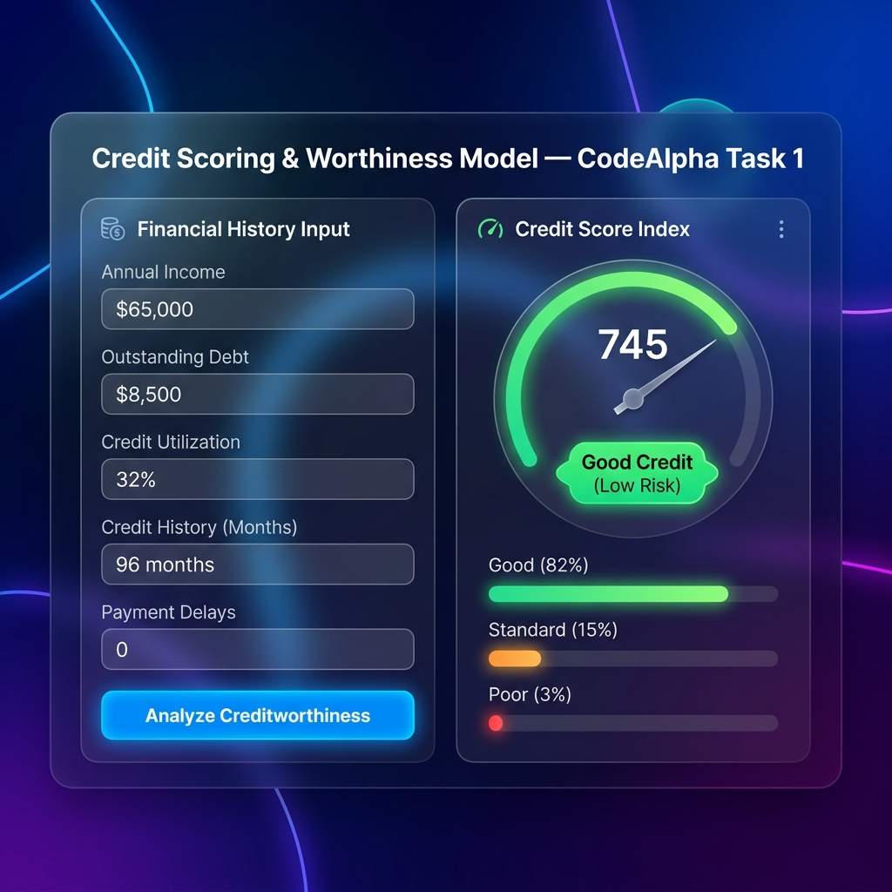
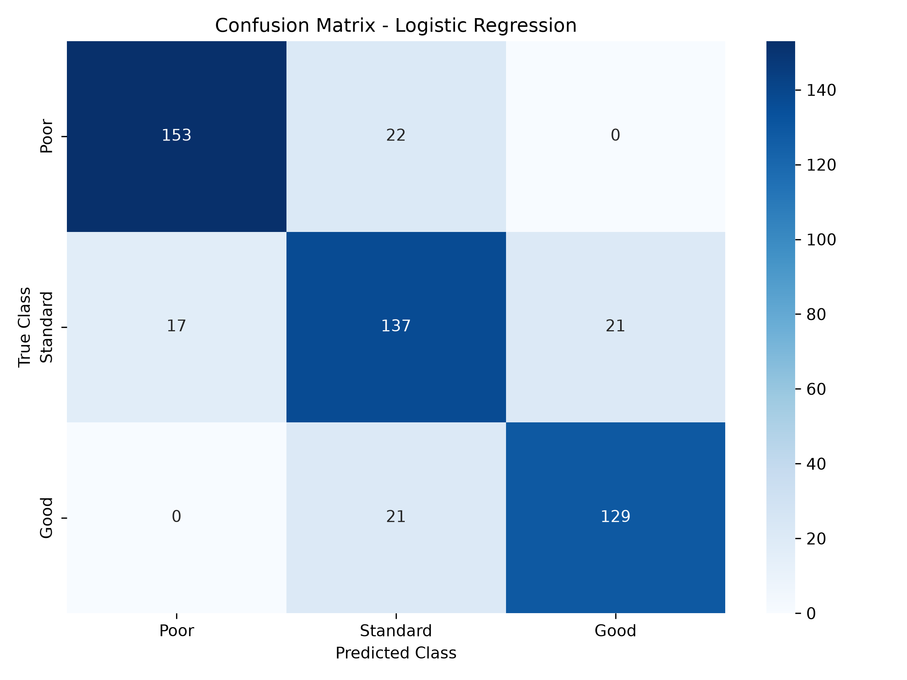

# Task 1: Credit Scoring Model — CodeAlpha Machine Learning Internship



## 📌 Project Overview
This repository contains a complete machine learning solution for **Credit Scoring & Creditworthiness Prediction**, developed as part of the **CodeAlpha Machine Learning Internship**.

The model classifies individuals into creditworthiness categories (`Poor`, `Standard`, `Good`) based on financial history parameters, helping financial institutions assess credit default risk automatically.

---

## 🚀 Key Features
- **Feature Engineering**: Calculates critical financial metrics like *Debt-to-Income Ratio (DTI)*, credit age index, payment delay penalties, and utilization rates.
- **Multi-Model Benchmark**: Evaluates **Logistic Regression**, **Decision Trees**, and **Random Forest Classifiers**.
- **Model Evaluation**: Assesses Performance using **Precision**, **Recall**, **F1-Score**, and **ROC-AUC** metrics.
- **Interactive Web Interface**: Complete Flask visual app with real-time score index calculator, glassmorphic UI, and probability breakdowns.

---

## 📊 Model Evaluation & Confusion Matrix


---

## 🛠️ Installation & Usage

1. **Install Dependencies**:
   ```bash
   pip install -r requirements.txt
   ```

2. **Generate Dataset & Train Model**:
   ```bash
   python train_model.py
   ```

3. **Run Interactive Web Application**:
   ```bash
   python app.py
   ```
   Open your browser at `http://localhost:5001`.

---

Developed for **CodeAlpha Machine Learning Internship**.
